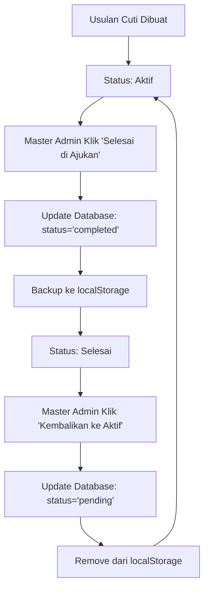

# Implementasi Status Usulan per Unit - Database Storage

## Ringkasan Perubahan

Implementasi menu "Usulan per Unit" telah diperbaiki untuk menyimpan status usulan secara permanen di database, sehingga data dapat di-fetch secara aktual dan konsisten.

## Perubahan Utama

### 1. Enhanced Database Schema

**Tabel: `leave_proposals`**
- ✅ Menambahkan status `'completed'` ke constraint check
- ✅ Menambahkan kolom `completed_by` (UUID reference ke users)
- ✅ Menambahkan kolom `completed_at` (TIMESTAMP)
- ✅ Menambahkan indexes untuk query performance:
  - `idx_leave_proposals_unit_date_status` - untuk query berdasarkan unit, tanggal, dan status
  - `idx_leave_proposals_completed_status` - untuk query status completed
  - `idx_leave_proposals_completed_by` - untuk tracking siapa yang menandai selesai
  - `idx_leave_proposals_completed_at` - untuk sorting berdasarkan waktu completion

### 2. Enhanced Completion Manager (`src/lib/simpleCompletionManager.js`)

**Database-First Approach:**
- ✅ Prioritas utama: menyimpan status di database
- ✅ Fallback: localStorage sebagai backup
- ✅ Bulk query untuk performance yang lebih baik
- ✅ Auto-create proposal record jika belum ada

**Key Functions:**
```javascript
// Cek status completion dari database
isSimpleProposalCompleted(unitName, proposalDate)

// Tandai sebagai selesai (database + localStorage backup)
markSimpleProposalAsCompleted(unitName, proposalDate, requestsData)

// Kembalikan ke status aktif
restoreSimpleProposal(unitName, proposalDate)

// Ambil semua completion records
getAllSimpleCompletions()
```

### 3. Enhanced BatchLeaveProposals Component

**Improved Data Fetching:**
- ✅ Bulk query untuk semua completed proposals dari database
- ✅ Mengurangi jumlah individual queries
- ✅ Better error handling dan retry logic
- ✅ Improved caching strategy

**Status Tracking:**
- ✅ Real-time status dari database
- ✅ Konsisten antara sessions dan users
- ✅ Audit trail (siapa dan kapan menandai selesai)

## Alur Kerja Status Usulan

### 1. Status "Aktif" (Default)
- Usulan cuti yang baru dibuat atau belum ditandai selesai
- Dapat dilihat di tab "Aktif" 
- Dapat dibuat surat batch
- Dapat ditandai sebagai "Selesai di Ajukan"

### 2. Status "Selesai di Ajukan" (Completed)
- Usulan yang sudah ditandai selesai oleh Master Admin
- Tersimpan di database dengan:
  - `status = 'completed'`
  - `completed_by` = ID user yang menandai
  - `completed_at` = timestamp kapan ditandai
- Dapat dilihat di tab "Selesai"
- Dapat dikembalikan ke status aktif

### 3. Database Storage Flow



## Benefits

### 1. Data Persistence
- ✅ Status tersimpan permanen di database
- ✅ Tidak hilang saat clear browser cache
- ✅ Konsisten antar device dan session

### 2. Multi-User Consistency
- ✅ Semua Master Admin melihat status yang sama
- ✅ Real-time updates antar users
- ✅ Audit trail siapa yang mengubah status

### 3. Performance
- ✅ Bulk queries mengurangi database load
- ✅ Efficient indexing untuk query cepat
- ✅ Smart caching strategy

### 4. Reliability
- ✅ Database sebagai source of truth
- ✅ localStorage sebagai fallback
- ✅ Graceful degradation saat offline

## Technical Implementation

### Database Queries

**Cek Status Completed:**
```sql
SELECT id, status, completed_at, completed_by, proposer_unit, proposal_date
FROM leave_proposals 
WHERE proposer_unit = ? AND proposal_date = ? AND status = 'completed'
```

**Bulk Load Completed Proposals:**
```sql
SELECT id, proposer_unit, proposal_date, completed_at, completed_by, status
FROM leave_proposals 
WHERE status = 'completed'
```

**Mark as Completed:**
```sql
UPDATE leave_proposals 
SET status = 'completed', completed_by = ?, completed_at = NOW()
WHERE proposer_unit = ? AND proposal_date = ?
```

### Error Handling
- ✅ Graceful fallback ke localStorage jika database error
- ✅ Retry logic untuk network issues
- ✅ User-friendly error messages
- ✅ Offline mode support

## Migration Applied

File: `supabase/migrations/20250122000001_enhance_completion_tracking.sql`

- ✅ Enhanced status constraint
- ✅ Added completion tracking columns
- ✅ Created performance indexes
- ✅ Added trigger untuk auto-set proposal_date
- ✅ Enabled realtime updates

## Testing

Untuk menguji implementasi:

1. **Test Marking as Completed:**
   - Buka menu "Usulan per Unit"
   - Pilih usulan di tab "Aktif"
   - Klik "Selesai di Ajukan"
   - Verify: usulan pindah ke tab "Selesai"

2. **Test Database Persistence:**
   - Mark usulan sebagai selesai
   - Refresh halaman atau logout/login
   - Verify: status tetap "Selesai"

3. **Test Restore:**
   - Pilih usulan di tab "Selesai"
   - Klik "Kembalikan ke Aktif"
   - Verify: usulan kembali ke tab "Aktif"

4. **Test Multi-User:**
   - User A mark usulan sebagai selesai
   - User B refresh halaman
   - Verify: User B melihat status yang sama

## Monitoring

Check database untuk monitoring:

```sql
-- Lihat semua completed proposals
SELECT proposer_unit, proposal_date, completed_at, completed_by 
FROM leave_proposals 
WHERE status = 'completed' 
ORDER BY completed_at DESC;

-- Count by status
SELECT status, COUNT(*) 
FROM leave_proposals 
GROUP BY status;
```